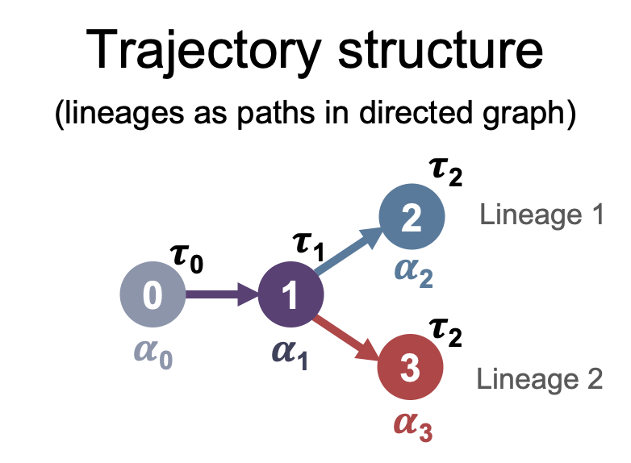

# Chronocell

Chronocell is a Python package that implements the trajectory fitting procedures described in the paper [Trajectory inference from single-cell genomics data with a process time model](https://doi.org/10.1371/journal.pcbi.1012752) by Meichen Fang, Gennady Gorin and Lior Pachter, PLoS Computational Biology, 2025. The associated code and data to reproduce the results from the publication are available in a separate repository: https://github.com/pachterlab/FGP_2024.

# Usage

## Installation

Clone this repository to your local machine using Git:

```
git clone https://github.com/pachterlab/Chronocell.git
```

After installation, you can use the package as follows:
```
import Chronocell
```
Or import specific objects directly:
```
from Chronocell.inference import Trajectory
from Chronocell.mixtures import PoissonMixtureSS, PoissonMixture, GammaPoissonMixture
from Chronocell.plotting import *
```

## Trajectory class
The core component of this project is the Trajectory class, which allows for the creation of trajectory instances and provides the code to fit them to data using the Expectation-Maximization (EM) algorithm. 

### Initialization
Create a `Trajectory` instance by providing the topology and tau parameters which describe the trajectory structure, and model that specify the trasncription model, along with optional settings:

```
trajectory = Trajectory(
    topo,                 # 2D numpy array representing the trajectory topology (integers)
    tau,                  # Array of tau parameters (floats)
    model="two_species_ss",   # Model type (default: "two_species_ss")
    restrictions={},          # Optional model restrictions (default: empty dict)
    verbose=0,                # Verbosity level (default: 0)
    store_info=True           # Whether to store additional info (default: True)
)
```

Each row of `topo` denotes one lineage. Below, we show examples of `topo` for three different trajectory structures. `tau` is the array of switching times, which are shared across different lineages. We assume the first switching time is fixed as $\tau_0 = 0$, and the last entry of $\tau$ marks the end of the observation.




```model``` specifies the used transcription model. we have two classes of models based on the assumption of global switch time: (1) "two_species_ss", the synchronized model, assumes a completely synchronized switch in transcription rates across all genes; and (2) "two_species_ss_tau", the desynchronized model, assumes each gene has its own switching time. The desynchronized model is more challenging to fit from scratch, so we recommend using a warm start based on the results of the synchronized model. The suffix `ss` in the model name stands for steady state, because we assume that initial state 0 is at steady state.


### Fit

To estimate model parameters from data, use the `.fit()` method on a `Trajectory` instance. This method applies an Expectation-Maximization (EM) algorithm.

```
trajectory.fit(X, warm_start=False, Q=None, theta=None, prior=None, norm_Q=True, 
               fit_tau=None, m=101, n_init=10, epoch=100, 
               parallel=False, n_threads=1, seed=42)
```

`X` is the scRNA-seq count matrix of shape (n_cells, n_genes). Warm start (warm_start=True) uses existing posteriors (Q) or parameters (theta) as initialization. Recommended when switching from synchronized to desynchronized models. Multiple initializations (warm_start=False) runs multiple EM fits with different random initializations and selects the best based on ELBO. `Q` (np.ndarray, optional) is the 3D array representing posterior probabilities of cells over lineages and time points. `theta` (np.ndarray, optional)is the initial values for model parameters. The `prior` is the prior distribution of the latent variables (process time and lineages) for each cell. This is represented as a 3D array with shape (n, L, M), where n is the number of cells, L is the number of lineages, and M is the number of time grids.

The method returns the fitted Trajectory instance with the following attributes: 1) Q, posterior assignments for each cell over time and lineage; 2) theta, estimated model parameters; 3) elbos, evidence lower bounds (ELBOs) of runs.

Based on `Q` and `theta`, other relevant information such as the Akaike Information Criterion (AIC) and the Fisher information matrix can also be calculated.
